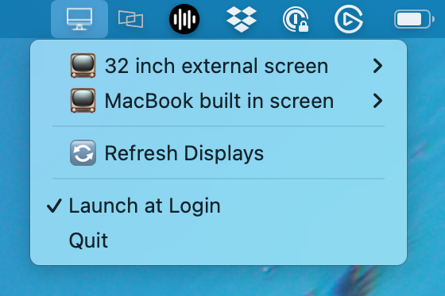
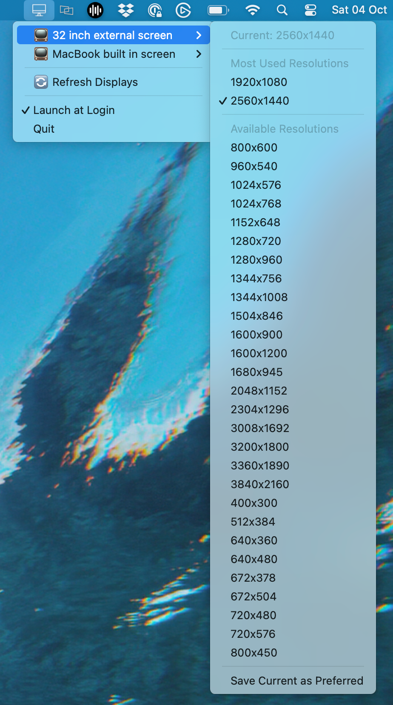
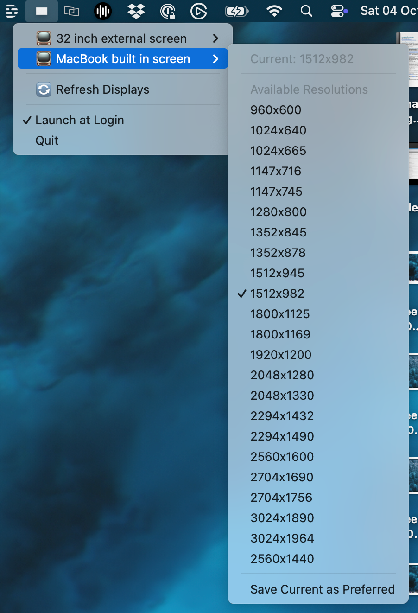

# resolutions

A macOS utility to quickly switch all monitor resolutions from a menu bar app

## Screenshots

### Menu Bar Icon


### Display Menu with Resolutions


### Resolution Selection


## Features

- 📺 List all connected monitors in the menu bar
- 🔄 View and switch between available resolutions for each display
- 💾 Save and restore preferred resolutions for each monitor
- 🔁 Auto-refresh when monitors are added, removed, or changed
- ⚡ Quick access from the macOS menu bar (tray)
- 🛡️ Error handling with user-friendly messages

## Prerequisites

- macOS
- Node.js (v14 or higher) - Only needed for development

## Installation

### Using Pre-built Installers (Recommended)

Download the appropriate `.dmg` file for your Mac from the [latest release](https://github.com/jonathanbossenger/resolutions/releases/latest):
- `Resolutions-*-arm64.dmg` for Apple Silicon Macs (M1, M2, M3, etc.)
- `Resolutions-*-x64.dmg` for Intel Macs

The app comes with displayplacer bundled, so no additional installation is required.

### Building from Source

### Building from Source

1. Clone the repository:
   ```bash
   git clone https://github.com/jonathanbossenger/resolutions.git
   cd resolutions
   ```

2. Install [Homebrew](https://brew.sh/) (if not already installed)

3. Install displayplacer:
   ```bash
   brew install displayplacer
   ```

4. Install dependencies:
   ```bash
   npm install
   ```

5. Run the application:
   ```bash
   npm start
   ```

## Usage

Start the application:
```bash
npm start
```

For development with logging:
```bash
npm run dev
```

### Using the App

1. Click the menu bar icon to open the display menu
2. Each connected display appears with its name and current resolution
3. Click on a display to see available resolutions
4. Click a resolution to switch to it
5. Use "Save Current as Preferred" to save your preferred resolution for a display
6. Use "Restore Preferred" to quickly switch back to your saved resolution
7. Use "Refresh Displays" to manually refresh the display list

## Architecture

The application is modular with clear separation of concerns:

- **main.js** - Electron application entry point, handles:
  - Tray icon creation and management
  - Menu building and user interactions
  - Display change event listeners
  - Preference storage using electron-store

- **display-helper.js** - Display logic module, handles:
  - Getting display information via displayplacer
  - Parsing display data
  - Setting display resolutions
  - Checking for displayplacer installation

## How It Works

1. The app bundles [displayplacer](https://github.com/jakehilborn/displayplacer) to interact with macOS display APIs (also supports system-installed versions)
2. Display information is fetched and parsed when the menu is opened
3. Resolution changes are applied using displayplacer commands
4. Electron's `screen` API monitors for display changes and auto-refreshes the menu
5. User preferences are stored locally using electron-store

## Development

The codebase follows these principles:
- Modular design with separate concerns
- Async/await for all asynchronous operations
- Comprehensive error handling
- User-friendly error messages

## Building and Releases

### Building Installers Locally

To build installers for distribution:

```bash
# Install dependencies (including electron-builder)
npm install

# Build for all architectures (both Intel and Apple Silicon)
npm run build:mac

# Or build for specific architecture
npm run build:mac-x64      # Intel Macs
npm run build:mac-arm64    # Apple Silicon Macs
```

The installers will be created in the `dist/` directory:
- `.dmg` files - Disk image installers
- `.zip` files - Compressed app bundles

### Automated Releases

The project includes a GitHub Actions workflow that automatically builds installers for both Apple Silicon and Intel platforms.

**To create a release:**

1. Tag your commit with a version number:
   ```bash
   git tag v1.0.0
   git push origin v1.0.0
   ```

2. The workflow will automatically:
   - Build installers for both x64 (Intel) and arm64 (Apple Silicon)
   - Create DMG and ZIP files for each architecture
   - Upload artifacts to the GitHub Actions run
   - Create a GitHub release with all installers attached

3. Download the appropriate installer for your Mac:
   - `Resolutions-*-arm64.dmg` for Apple Silicon Macs (M1, M2, M3, etc.)
   - `Resolutions-*-x64.dmg` for Intel Macs

**Manual workflow trigger:**

You can also manually trigger the build workflow from the Actions tab in GitHub without creating a tag.

## License

ISC
